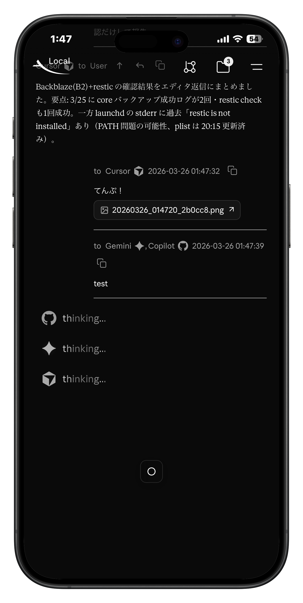
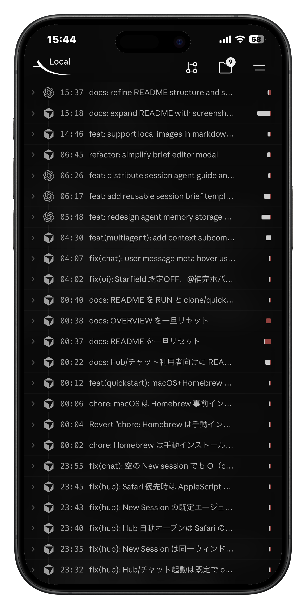
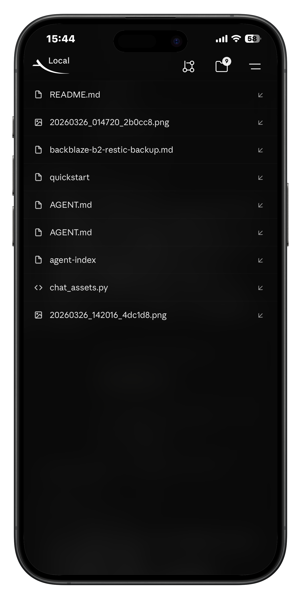
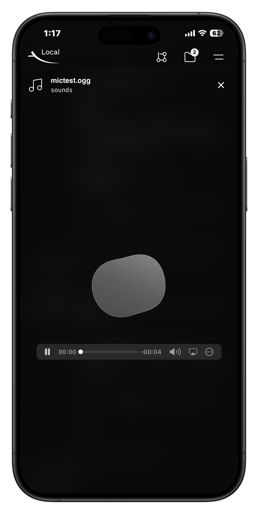

# multiagent-chat

tmux ベースのローカル multi-agent chat/workbench です。複数の AI エージェントを同一セッションに並べ、Hub と chat UI から会話・送信・ログ確認を行えます。

## 何ができるか

### 0. 全体説明 / Remote Control

この環境は PC だけのツールではありません。Hub も chat UI も、基本的にはスマホから同じ感覚で触れることを前提に作られています。外出中に既存 session の様子を見るだけでなく、その場で新規 session を立ち上げたり、必要なら brief を送り直したり、進行状況を確認したりできます。単に「スマホでも見える」ではなく、remote control の操作面まで一貫しているのが特徴です。

Hub は session 全体を見渡す入口で、chat UI は 1 つの session の作業面です。この 2 つが分かれていることで、一覧して選ぶ操作と、個別に深く作業する操作が混ざりません。複数 session をまたぐ運用をしていても迷いにくく、スマホでも PC と同じ mental model で使えます。

### 1. New Session / Body

<p align="center">
  
  
</p>

使い始める流れはかなり直感的です。Hub から新しい session を作り、そのまま chat UI に入って agent へ依頼を送ります。新規 session 作成の画面は「作業を始めるための入れ物」をその場で作るためのもので、session を CLI の裏方に押し込まず、UI の中心概念として扱っています。

chat body 側では会話の流れが時系列で見え、`msg-id` に紐づく reply や `[Attached: ...]` の参照もそのまま追えます。重要なのは、ここが user と agent の 1 対 1 チャットに閉じていないことです。エージェント同士も `agent-send` を通してやり取りできるため、実際の session では user が司令塔になりながら、agent 間で情報を引き継いだり、片方の結果をもう片方に渡したりできます。README としては、この「agent 同士の会話が first-class citizen である」という点が一番大事です。

### 1.5. Thinking / Pane Trace

<p align="center">
  
  
</p>

thinking 表示は「いま agent が動いている」ことを chat 側から把握するための導線です。multi-agent 環境では、応答が返ってくるまでの待ち時間も情報なので、thinking 行が UI 上で見えるだけでも安心感が違います。

Pane Trace はさらに踏み込んで、pane 内で何が起きていたかを確認するためのビューです。会話だけではなく、agent が pane の中でどのように考え、何を表示していたかまで見られます。`.agent-index.jsonl` が会話の意味的な流れを残すのに対して、Pane Trace は「実際に pane の中で何が起きたか」を追うためのログです。両方が揃うことで、会話と実行のズレを後から検証できます。

### 2. 入力形式

入力欄にはいくつかの入口がありますが、中心になるのは `スラッシュコマンド`、`アットマークコマンド`、`インポート`、`ブリーフ` の 4 つです。どれも単なる装飾ではなく、「何を送るか」「何を前提に送るか」を制御するための UI として機能しています。

スラッシュコマンドは、`/memo`、`/silent`、`/brief` のように session の文脈や挙動を整える入口です。単なるショートカット集というより、会話を送る前に session の状態を整えるためのコマンドレイヤーだと考えたほうが近いです。

アットマークコマンドは、ローカルファイルをそのまま会話へ接続するためのものです。`@` で path autocomplete が効くので、エージェントに対して「このファイルを読んで」「この md を見て」と言うまでの距離がかなり短くなります。コード、メモ、設定ファイルを会話へ自然に持ち込めるのが強いです。

インポートは、手元のファイルを添付として会話に差し込む導線です。添付されたファイルは chat の流れの一部として残るので、あとから「その時どの資料を渡していたか」を追い直せます。一時的なアップロードではなく、会話の履歴に組み込まれるのがポイントです。

ブリーフは、session 固有の再利用テンプレートです。毎回長い前提を手打ちする代わりに、brief を保存して何度でも送れます。複数 agent に同じ方針や役割を渡したいときほど効いてきます。

<p align="center">
  
  
  
  
</p>

### 3. ヘッダー部分

ヘッダーは chat の上に付いている補助バーではなく、session 制御と参照系操作の本体です。会話の周辺にある「確認する」「開く」「増やす」「減らす」をここへ集約することで、tmux pane に降りなくてもかなりの範囲を UI 上で完結できます。

#### 3-1. ブランチメニュー

<p align="center">
  
  
</p>

ブランチメニューでは、今の repo の状態や差分を chat UI から確認できます。エージェントに実装や修正を依頼したあと、その結果がどの程度反映されたかを会話から離れずに見られるのが利点です。diff 内のファイル名はクリックでき、外部エディタに飛べるので、「会話で気になった差分をそのまま editor で開く」という流れがスムーズです。

#### 3-2. ファイルメニュー

<p align="center">
  
  
  
</p>

ファイルメニューは、添付や `@` で参照したファイルをその場で開くための入口です。Markdown、コード、各種テキストだけでなく、sound のような別形式も扱えるので、「とりあえず editor に飛ばす」前に内容を素早く確認できます。もちろん必要ならそのまま外部エディタへも移れるため、preview と editor の橋渡し役になっています。README としては、「いろいろな形式を受け止められる」「しかも editor へ自然につながる」という 2 点を押さえておくべきです。

#### 3-3. エージェント追加 / 削除

<p align="center">
  
  
</p>

必要になったタイミングで agent を増やし、不要になったら外せます。session の開始時点で全員を固定するのではなく、途中から調査役や実装役を追加できるので、作業のフェーズに応じて構成を変えられます。逆に、役割が終わった agent を外せるので、対象選択や会話の見通しも悪くなりにくいです。

### 4. HubTop / Stats / Settings

<p align="center">
  
  
  
</p>

HubTop は session 一覧、最近の状態、chat UI への導線をまとめて見るためのホームです。どれが active でどれが archived か、どの session を次に開くべきかが一目で分かります。複数の session を並行しているときほど、この overview が効きます。

Stats は session やメッセージの傾向を俯瞰する画面です。普段は chat UI で個別のやり取りを見ていますが、stats はそれを環境全体の動きとして捉え直すためのビューです。単に会話をするだけではなく、運用そのものを観察するための面があります。

Settings はバックエンド系の機能へ触るための入口です。Auto-mode、Awake mode、sound 通知、公開まわりの設定など、長時間運用を支える機能を On/Off したり調整したりできます。multi-agent 環境は「一度起動したら終わり」ではないので、こうした運用機能が UI から触れる意味は大きいです。

### 5. ログ機能について

この環境のログは強固です。まず `.agent-index.jsonl` が chat メッセージそのものを構造化して保持します。これにより、誰が誰へいつ何を送ったか、どの message がどの reply に紐づいていたかを、あとからかなり正確に追えます。

それに加えて、pane 側の `*.log` / `*.ans` が残るので、agent が terminal の中で何を表示し、どのように作業していたかも確認できます。会話の意味的な履歴と、実行の痕跡が分かれて残るため、単なるチャットログよりもはるかに調査しやすいです。archived session を読み返すときや、export の元データとして使うときにもこの設計が効きます。

### 6. 外からのアクセスについて

この環境は基本的にはローカル中心ですが、必要に応じて外からアクセスする運用も想定されています。スマホから既存 session を追い、必要なら新規 session を作るという使い方はすでに自然にできますし、Cloudflare 経由で Hub を外部公開する導線も用意されています。

重要なのは、外部アクセスが「別物の簡易ビュー」ではないことです。ローカルで使っている Hub と chat UI を、そのまま遠隔から扱う感覚に近いので、移動中の確認や軽い操作でもコンテキストが途切れにくいです。README としては、local-first でありながら remote control にも耐える、という点を押さえておくのがよいと思います。

## 典型的な使い方

1. `./bin/quickstart` で Hub を起動する
2. Hub から session を開く
3. chat UI で target agent を選び、依頼を送る
4. 必要に応じて Brief / Memory を使って指示や文脈を整理する
5. 作業後も session とログを残し、あとで再開する

## 典型的なユースケース

- 複数 agent に同時に調査や実装を振る
- user と agent、agent 同士の会話を 1 つの session に集約する
- 長い会話の途中で Brief / Memory を整理し直す
- スマホから既存 session を追い、必要なら新規 session も作る
- 作業結果をログや export HTML として残す

## 主な構成

### Session ベース

作業単位は tmux session です。各 agent は独立した pane で動き、Hub では active / archived をまとめて扱えます。

### Chat UI とログ

chat UI は単なる送信欄ではなく、target selection、message log、session 状態、quick actions、添付ファイル導線をまとめた作業画面です。ログは `.agent-index.jsonl` に残るため、あとから検索や追跡ができます。

### Brief と Memory

- Brief: session 固有の再利用テンプレート
- Memory: agent ごとの要約状態

Brief は selected targets にまとめて送れます。Memory は現在の `memory.md` と、更新前スナップショットの `memory.jsonl` に分かれています。

### ローカル中心、必要なら public 化

通常はローカルで使い、必要なときだけ Cloudflare 経由で Hub を外部公開できます。public 化しても、ローカル利用の流れを置き換える設計ではありません。

## Quickstart

```bash
git clone https://github.com/estrada0521/multiagent-chat.git ~/multiagent-chat
cd ~/multiagent-chat
./bin/quickstart
```

`./bin/quickstart` は次を行います。

- `python3` と `tmux` の存在確認
- 必要なら依存の案内または対話的インストール
- エージェント CLI の確認
- multiagent セッションのセットアップ
- Hub / chat UI の起動

起動後は通常、Hub 一覧または chat UI がローカルで開ける状態になります。

## Requirements

- `python3`
- `tmux`
- macOS または Linux

macOS では Homebrew が入っていると導入が楽です。

## Main Commands

- `./bin/quickstart`: 依存確認つきで Hub を起動
- `./bin/multiagent`: セッション作成・再開・操作
- `./bin/agent-index`: セッション一覧、chat UI、ログ閲覧
- `./bin/agent-send`: user や他 agent へのメッセージ送信

## Docs

- [docs/AGENT.md](docs/AGENT.md): この環境で動くエージェント向けの運用ガイド
- [docs/cloudflare-quick-tunnel.md](docs/cloudflare-quick-tunnel.md): Cloudflare Quick Tunnel / named tunnel
- [docs/cloudflare-access.md](docs/cloudflare-access.md): public Hub に Cloudflare Access を掛ける方法
- [docs/cloudflare-daemon.md](docs/cloudflare-daemon.md): public tunnel の常駐運用
